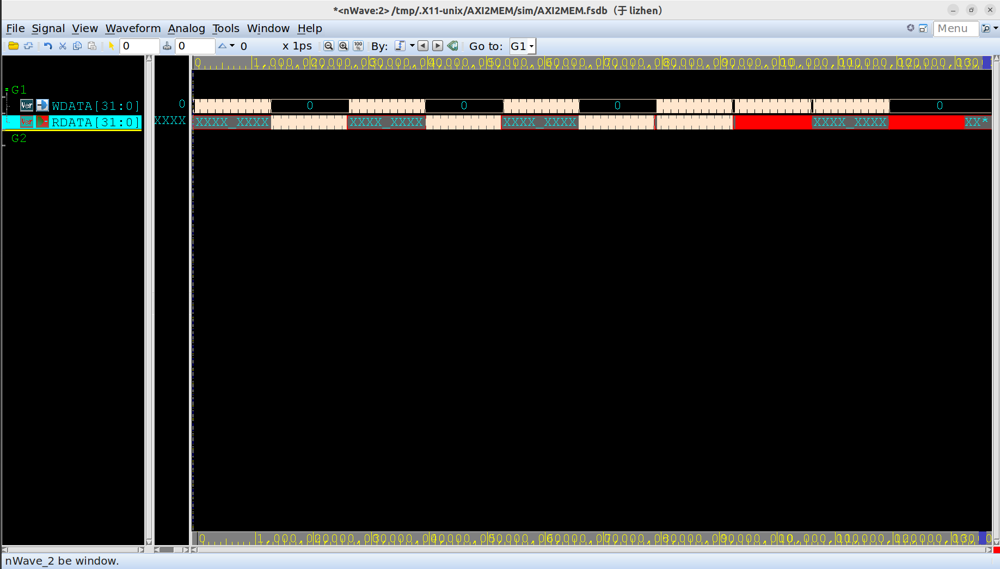

# 基于AXI4.0的Memor

## 关于rtl

1. 支持突发读写和回环读写，回环上限设置为了60
2. 不支持Out of order 和 Outstanding
3. **支持一定程度的同时读写**

Memory使用的是OpenRAM生成的memory，原本是同步读写；我改成了同步写和异步读。

Memory由8片单端口sram组成，其中4片sram（8位）组成一个0号片（32位），另外4片sram（8位）组成1号片（32位）；**允许同时读写不同的片**，此时读写不会有任何阻塞（即写0号片的同时可以读1号片）；**如果同时读写同一片，则会产生阻塞，直到等待读或者写完成才允许写或读**。（在写的过程中发出读请求，会阻塞读请求，直到写完成才继续读；如果读写请求同时发生，优先考虑读请求）

## 关于tb

tb测试的内容：

1. 先进行128次突发写，再进行128次的突发读
2. 再进行128次回环写，再进行128次回环读
3. 然后再依次发起读写请求（发起时不考虑读或者写是否完成，而是直接发起，发起间隔很短）
4. 改变3步骤的地址的片，即同时读写同一片，同时读写不同的片

## 关于sim

用的是verdi和vcs，仿真图大概是这样（简单起见就截了这个）

> 后面的两次读报红是因为，前面做了写选通